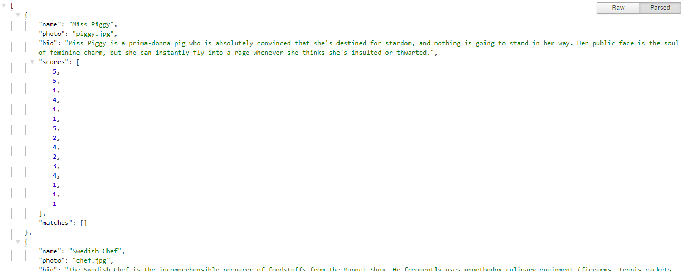
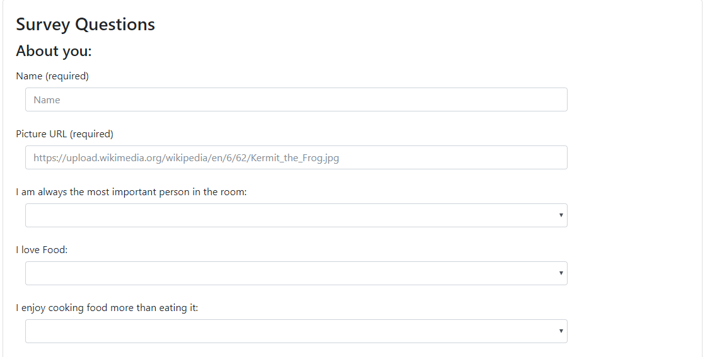
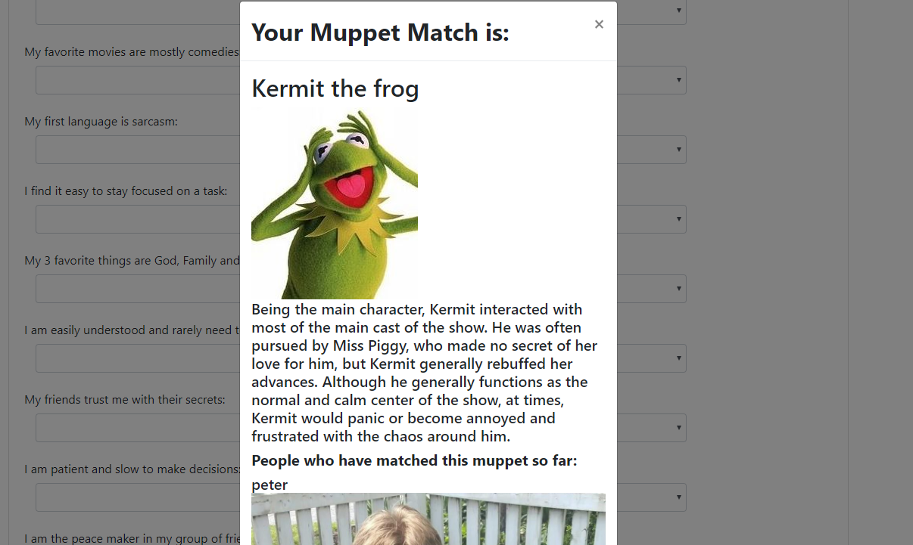

# FriendFinder
finding friends with express and node
-----------------------------------------
#### February 2018 

-----------------------------------------

Current Version 1.0

---

FriendFinder - Is now owned by Muppet Finder!
Don't waste time looking for love and friends.  Muppet Finder does so much more for you.

Simply fill in the simple survey, including your name and your picture, and Muppet Finder will match you with the perfect Muppet.  If you are curious who else matched that muppet, Muppet Finder will display a list of other Muppet seekers who have matched that same Muppet.

---

## Screenshots

<table>
    <tr>
        <td>
            
        </td>
        <td>
            
        </td>
        <td>
            
        </td>
        <td>
            
        </td>
    </tr>
</table>

## How you can help

* Please let us know if you find any errors or if you have ways to achieve better efficiency.

## More Project Details
FriendFinder (MuppetFinder) Is a javascript node application running on heroku.  It uses the express module. 

1. The initial page welcomes you and gives you the option to begin the survey or view the raw API data or go to the git repository.

2. The survey asks you for your name, picture and the answers to 15 questions.

3. Your survey answers are calculated against the survey answers of 12 different Muppets, and you are matched with the Muppet with the smallest delta of deviation.

4. If anyone else has ever been matched to your Muppet, their name and picture will also be shown, so that we can keep in the same spirit as the original assignment.

-----------------------------------------

API View is a link that shows you what data is stored by the App. All Muppet survey answers are shown as well as the names and picture links of the people who have matched those muppets.

-----------------------------------------

### How does the app work?

1. The app uses the express node app to serve the pages.

2. The routing is done in javascript using the express module.

3. The app is hosted on heroku.

## Dependencies
    
    "express": "^4.16.2"

## History

This project was created for a homework assignment on 2/07/2018 for the University of Richmond Programming Bootcamp.

## License

This project is in the public domain within the United States, and
copyright and related rights in the work worldwide are waived through
the [CC0 1.0 Universal public domain dedication](https://creativecommons.org/publicdomain/zero/1.0/).